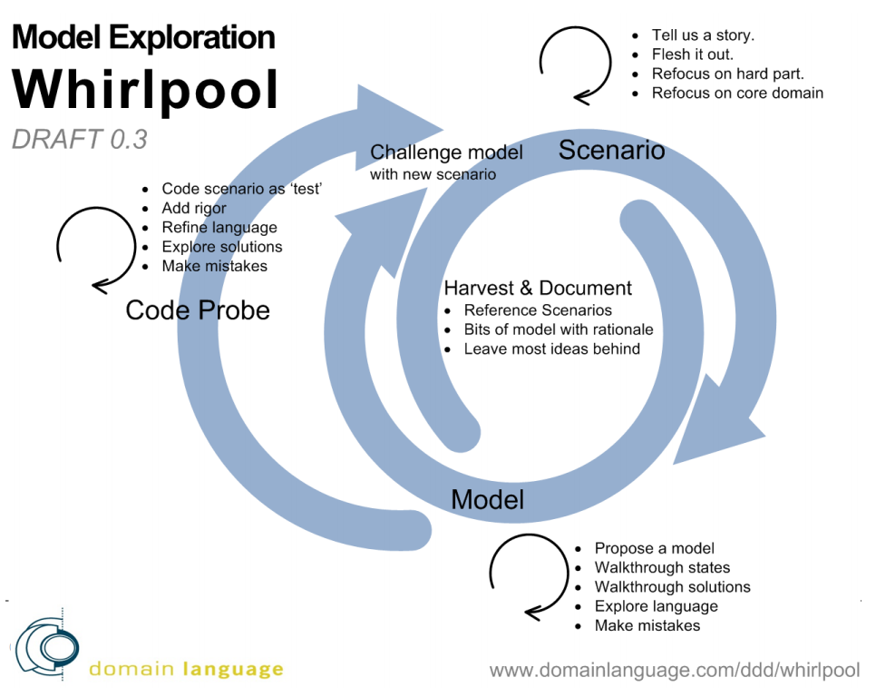

# Helpful Articles

* The Lean of Scrum: http://msdn.microsoft.com/en-us/library/vstudio/jj161049.aspx
* Why You Need a Hybrid System: http://www.netobjectives.com/blogs/why-you-need-hybrid-system
* Why Contrasting Scrum and Kanban belies a lack of understanding of both: http://uberconf.com/blog/alan_shalloway/2013/07/why_contrasting_scrumban_and_kanban_belies_a_lack_of_understanding_of_both
* From Scrum to Lean: http://net.tutsplus.com/articles/editorials/from-scrum-to-lean/
* Testers and Developers Think Differently: http://www.stickyminds.com/sitewide.asp?ObjectId=2291&Function=edetail&ObjectType=ART
* List of all Visual Studio ALM Virtual Machines: http://blogs.msdn.com/b/briankel/archive/2013/04/17/list-of-all-visual-studio-alm-virtual-machines.aspx
* Manual Cucumber Tests?: http://technicaldebt.com/?p=1229

# Videos

* [Lean from the Trenches](http://vimeo.com/55014114) (1 h)
* [Creating Robust Coded UI Tests in Visual Studio](http://channel9.msdn.com/Events/TechEd/Europe/2012/DEV312#formats) (1.25 h)

# Related Books

* [Lean from the Trenches](http://pragprog.com/book/hklean/lean-from-the-trenches) -- H. Kniberg

# Caution: WIP

Kanban, as applied to software development, is not a perfect discipline. 

It's meant to be adopted gradually, and evolved from a team's experience. [Learn the basics here](http://en.wikipedia.org/wiki/Kanban_\(development\)).

## Four basic principles

* Start with what you do now
* Agree to pursue incremental, evolutionary change
* Respect the current process, roles, responsibilities & titles
* Leadership at all levels

## Six core practices

David Anderson's six core practices for using Kanban with software development:

### **Visualise** 

> The workflow of knowledge work is inherently invisible, so make it visible!

### **Limit WIP**

> Limiting work-in-process implies that a pull system is implemented on parts or all of the workflow.

### **Manage flow** 

> The flow of work through each state in the workflow should be monitored, measured and reported.

### **Make policies explicit**

> Until the mechanism of a process is made explicit it is often hard or impossible to hold a discussion about improving it.

### **Implement feedback loops** 

> Collaboration to review flow of work and demand versus capability measures, metrics and indicators coupled with anecdotal narrative explaining notable events is vital to enabling evolutionary change.

### **Improve collaboratively, evolve experimentally**

> Use models and the scientific method to pursue small, continuous, incremental and evolutionary changes that stick. 

# Practicing the practices

## Visualise: The Kanban Board

TODO: move this to LIMIT WIP section: WIP Limit = 9 Cards (derived from 1.5 x team size).

## Issue States

Ideally, the fundamental states of the issue (open and closed) represent the issuer's perspective, while the lanes on the Kanban Board are internal "sub-states" useful to organizing the work of the team.

### Open

Any one can open a new card. The default lane for new items is unprioritized. A card is considered open until it has been [resolved](Resolutions.md).

### Closed

The Product Owner closes cards. Cards are removed from the Kanban Board when they are closed. The Product Owner provides a [resolution](Resolutions.md) to signal the outcome as completed or not.

## Lanes

The lanes follow this basic flow:

> Unprioritized -> Prioritized -> In Dev -> Ready for Test -> In Test -> Ready for UAT -> In UAT -> Ready for Delivery?

**NOTE:** Cool kids beware: this is not about "throwing things over the wall", it's about being able to see where things are relative to their delivery state, period.

### 0 - Unprioritized

All cards enter the board as unprioritized work. Cards may be entered by anyone, though usually they are entered in collaboration with the Product Owner.

Before the Product Owner will move a card from **Unprioritized** to **Prioritized**, the card must meet these criteria:

* Has a **descritive and specific title**.
* Has a description from the **user perspective**.
* Has been **tagged** as enhancement, defect, or question.

TODO revise this: WIP Limit = 18 cards (yesterday's weather for cards worked in 2 weeks). Not subject to board WIP Limit.

### 1 - Prioritized

Cards that are in this state have been prioritized by the Product Owner. The prioritization process is not done **in an ivory tower** without the team or other important people participating, but ultimately it is the Product Owner's doing to move the card.

TODO: WIP Limit = None. Subject to board WIP Limit.

### In Dev

If you are a devekioer, it's your responsibility to pull a card out of the **Prioritzed** queue and into the **In Dev** lane.

When a card is **In Dev**, all kinds of collaborative activities happen that are specific and necessary for that card. The exact activities will **vary from card to card, and that's why it is a collaborative process, not a throw-over-the-wall process**. The team must collaborate and communicate regularly to decide what the activities are.

#### In Dev activities:

**NOTE:** The activities below represent an idealized linear flow, but it's important to know that there is often 
significant back-and-forth motion. That's fine -- that's what it takes to collaborate and iteratively develop the right thing (and develop the thing right).

* **[Having Three Amigos sessions](../Ceremonies/ThreeAmigos.md)**
  * Typical flow: If you are a Dev, then you pulled the card and you should schedule the first session with the tester and P.O. as close to pulling as possible.
  * Additional sessions: anyone can prompt or schedule additional sessions throughout a card's **In Dev** state when necessary for further collaboration and understanding.
    * Remember that a Three Amigos sessions is not limited to "Dev, Tester, P.O.", but can and should include other people (like Sales, Product Specialist, Support, Users, etc) when the specific situation calls for it.    
    * It's very similar to what Eric Evans calls Knowledge Crunching in the blue DDD book and later termed "Model Exploration". A picture of the process looks like this: 
* **Outlining Acceptance Criteria** -- expressions of what is needed to consider the card DONE. These can start as very simple sentences or notes. Don't get caught up on lack of formality. Instead, have a conversation with the person who wrote them to refine them into true Specifications:
* **Refining Acceptance Criteria into Specifications by Example** -- 
  * If the card is an enhancement, it has a **scenarios** section in a feature file (hyperlinked).
  * If the card is a sufficiently complex enhancement to UI, it has a **mockup** (hyperlinked).
  * If the card is a defect:
    * It has **steps to reproduce**.
    * It includes an **error message or screen shot** of the invalid state.
* **Designing 'spikes' and higher fidelity prototypes** -- early on in a card's **In Dev** state, it is perfectly acceptable and encouraged to work on a 'spike' version of the solution, and then have another Three Amigos session and focus on some feedback-generating questions like:
  * How is the UX and Usability so far? 
    * Do we need Matt or Sarah to help us?
  * Is this spike progressing toward the Acceptance Criteria? 
    * Does the spike inform and change the Acceptance Criteria now?
  * Are there any remaining uncertainties about that we want to spike on?
  * Should we take the output from this particular spike and proceed to fully developing it?
    * If no, then what's our next step?
* **Developing the real feature -- Close collaboration between Dev, Tester, Support Team, PO, and even Early  Access Users** 
  * Once development moves from 'spike' to 'real', it does not mean that collaboration stops! It does mean this:
    * The level of Specification is sufficient for the type of work item and is agreed upon by the dev, tester, P.O., and other stakeholders who are involved with this item (think: Support Team Member, Users)
      * For some enhancements: the team agrees that the **scenarios** in the feature file will become automated tests. 
      * For others, they will be manually tested. 
      * In either case, the scenarios are understood and agreed upon.
* **Proactively testing the real feature** --  The Dev and Tester should be collaborating closely. 
  * When the Dev feels like there is something to 'demo', the Tester is available that day, or at worst the next day, to review the work with the Dev, and potentially with other people.
  * For items with automated tests, the Dev and Tester work together to decide who is best equipped to automate a given test.

### Ready for Test (ready for Carlena)

When a developer who has pulled an item into **In Dev** feels the item is ready for Carlena to test, the developer
places the card in ready for test. Next:

* Carlena and the developer, at minimum, will arrange an overview GTM session
* Carlena will accept the item after the demo, or it will be placed back in **In Dev** if there is something wrong that 
is easily identified during the overview demo.

### In Test

When Carlena is actively testing an item, she will pull it from **Ready for Test** and place it into this lane.

During this state, Carlena will be:

* Performing Test Cases as specified in VersionOne
* Working with the developer to create Automated Tests where appropriate
  * Running the Automated Tests and ensuring that they run in the Jenkins build
* Identifying new Test Cases and adding them to VersionOne
* Filing new Defects against the items in VersionOne

### Ready for UAT (User Acceptance Test)

If an item makes it through the **In Test** state, Carlena will place it into **Ready for UAT**, indicating that it is
ready for additional User Acceptance Testing by a larger audience.

### In UAT

The goal of a UAT session is to exercise the user stories through additional tests

* Doing manual, exploratory tests
* Evaluating usability
* Testing with the Product Owner and representatives from one or more of the following groups:
  * Early Access Users
  * VersionOne Support
  * VersionOne Product Specialists
  * VersionOne Sales Team
  * Other stakeholders as identified

If the item fails during any of these tests, then it must go back to **In Dev** to work out the problem.

### Ready for Delivery

TODO: what goes here?

# NOTE: old notes below

### 2 - Speced

The team decides which cards from to pull from the prioritized cards. To exit this lane, the card must meet the following criteria:

* Has been coded.
* Has unit tests.
* Has issued a Pull Request.

WIP Limit = None. Subject to board WIP Limit.

### 3 - Coded

The team decides which cards to pull from the coded cards. To exit this lane, the card must meet the following criteria:

* Has been tested.
* Has been tagged with a **[resolution](Resolutions.md)**.

WIP Limit = None. Subject to board WIP Limit.

### 4 - Tested

The Product Owner decides when to close tested cards. This provides an opportunity to decide what to demo during iteration review (tagged as `demo`) and what should be in the release notes (tagged as `noteworthy`).

WIP Limit = None. Not subject to board WIP Limit.

## Thoughts

* Are some issues just tasks? How does a task fit with spec, code, and test? For example, Issue #27 on Three Amigos.
* For readability, is it better to have entry or exit criteria?
* Can we really distinguish between a defect and an enhancement, if there is no specification? Do we care about the difference in the execution of our workflow?
* What about questions and documentation? How does speced, coded, and tested fit with questions or documentation?
* Should we demo everything we put into release notes? If so, can't we just collapse the tag space to `noteworthy`?
* Where does "support certification" fit?
* Should we hold items in tested until they are published in a release? Can Jenkins close items as part of the promotion job? Should it?
* How do we account for stoptheline? Is it a feature of the Kanban Board or something more (signals in HipChat, email, etc)?
* GitHub considers Pull Requests as Issues. How can we better account for this? Unsolicited Pull Requests are work. But most of ours are in context of an existing issue. Do we need to account for this on the board?
* What about estimates? If we need them, I suggest estimates are part of prioirization, so should be exit criteria for `prioritized`.
